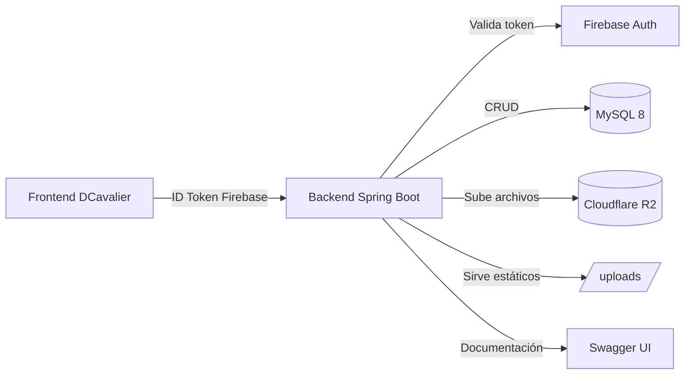
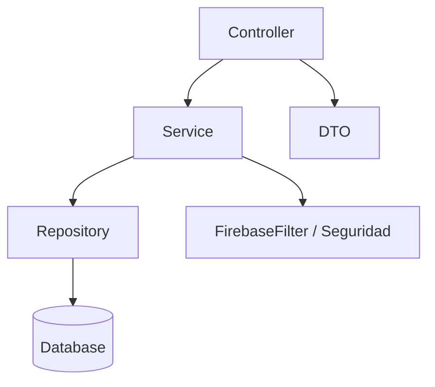

# DCava Backend — Documentación de la API REST

## 1. Información General

| Campo | Valor |
|---|---|
| **Nombre de la aplicación** | DCava Backend |
| **Versión** | 1.1.2 |
| **Basado en** | Spring Boot 3.5.16 |
| **Java** | 21 |
| **Base de datos** | MySQL 8 |
| **Formato de datos** | JSON (`application/json`) |
| **Autenticación** | Firebase Authentication (Bearer JWT) |
| **Almacenamiento de archivos** | Cloudflare R2 (S3-compatible) |
| **Logging** | JSON estructurado (stdout + archivo) con retención de 30 días |
| **URL base** | `http://localhost:8080` (o el puerto definido por `APP_PORT`) |

> **Nota:** El proyecto incluye Swagger UI. Una vez en ejecución, la documentación interactiva está disponible en:
>
> - Swagger UI: `http://localhost:8080/swagger-ui.html`
> - OpenAPI JSON: `http://localhost:8080/v3/api-docs`

---

## 2. Autenticación y Seguridad

### 2.1 Mecanismo de autenticación

El sistema usa **Firebase Authentication**. El flujo es:

1. El frontend de DCavalier autentica al usuario contra Firebase y obtiene un **ID Token**.
2. El cliente envía el token en cada petición mediante el header HTTP:

```
Authorization: Bearer <ID_TOKEN_DE_FIREBASE>
```

3. El backend valida el token en cada request a través del filtro `FirebaseFilter`. Si es válido, se resuelve el **UID** del usuario y se comprueba que esté registrado en la base de datos (`user_admin`).

### 2.2 Endpoints públicos vs. privados

La seguridad se define en `SecurityConfig.java` y `FirebaseFilter.java`.

**Rutas públicas (sin autenticación):**

| Prefijo | Descripción |
|---|---|
| `/health` | Estado de salud del servidor |
| `/products/**` | Consulta pública de productos |
| `/categories/**` | Consulta pública de categorías |
| `/advertisements/**` | Consulta pública de anuncios |
| `/uploads/**` | Archivos estáticos (imágenes subidas) |
| `/swagger-ui/**`, `/v3/api-docs/**`, `/swagger-ui.html` | Documentación OpenAPI |

**Rutas privadas (requieren token Firebase):**

- `/admin/**` — Gestión interna (productos, categorías, anuncios, imágenes)
- `/sales/**` — Gestión de ventas
- `/users/**` — Información de usuarios

### 2.3 Códigos de error de autenticación

| Estado HTTP | Significado |
|---|---|
| `401 Unauthorized` | Token ausente, mal formado, inválido o expirado |
| `403 Forbidden` | Token válido pero el usuario NO está registrado en el sistema |
| `400 Bad Request` | Petición mal formada o validación fallida |
| `404 Not Found` | Recurso solicitado inexistente |
| `500 Internal Server Error` | Error interno del servidor |

---

## 3. Convenciones generales

### 3.1 Respuestas paginadas

Varios endpoints devuelven una respuesta paginada con la siguiente estructura:

```json
{
  "content": [ ... ],
  "currentPage": 0,
  "totalItems": 150,
  "totalPages": 15,
  "size": 10
}
```

| Campo | Tipo | Descripción |
|---|---|---|
| `content` | `array` | Elementos de la página actual |
| `currentPage` | `int` | Índice de la página actual (0-based) |
| `totalItems` | `long` | Número total de elementos |
| `totalPages` | `int` | Número total de páginas |
| `size` | `int` | Tamaño de la página |

### 3.2 Fechas

Las fechas se serializan en formato ISO-8601 (`LocalDateTime`), por ejemplo: `2026-08-13T15:30:00`.

### 3.3 Parámetros de ordenación

Los parámetros `sort` y `order` controlan la ordenación de resultados:
- `sort`: nombre del campo por el que ordenar (por defecto `id`).
- `order`: `asc` (ascendente, por defecto) o `desc` (descendente).

### 3.4 Códigos de estado comunes

| Código | Descripción |
|---|---|
| `200 OK` | Operación exitosa |
| `400 Bad Request` | Petición inválida, validación fallida o error de negocio |
| `401 Unauthorized` | No autenticado o token inválido |
| `403 Forbidden` | Sin permisos (usuario no registrado) |
| `404 Not Found` | Recurso no encontrado |
| `500 Internal Server Error` | Error interno |

---

## 3.5 Health endpoint

#### `GET /health` *(público)*

Comprueba el estado de salud del servidor. Útil para balanceadores de carga y monitores de disponibilidad.

**Respuesta `200 OK`:**

```json
{
  "status": "UP",
  "service": "dcava-backend",
  "timestamp": "2026-08-13T15:30:00"
}
```

| Campo | Tipo | Descripción |
|---|---|---|
| `status` | `string` | Estado del servidor. Valor `UP` cuando está operativo |
| `service` | `string` | Nombre de la aplicación |
| `timestamp` | `datetime` | Marca de tiempo del servidor (ISO-8601) |

---

## 4. Productos

### 4.1 Objeto `Product` (público)

```json
{
  "id": 12,
  "name": "Cadena Shimano HG-11",
  "description": "Cadena de 11 velocidades para MTB",
  "price": 45.90,
  "category": "transmision",
  "status": "active",
  "stock": 25,
  "compatibility": "#shimano #11v #mtb",
  "createdAt": "2026-01-10T09:15:00"
}
```

| Campo | Tipo | Descripción |
|---|---|---|
| `id` | `int` | Identificador único |
| `name` | `string` | Nombre del producto |
| `description` | `string` | Descripción detallada |
| `price` | `double` | Precio de venta |
| `category` | `string` | Categoría (nombre/slug) |
| `status` | `string` | `active` o `inactive` (borrado lógico) |
| `stock` | `int` | Cantidad disponible |
| `compatibility` | `string` | Etiquetas de compatibilidad (hashtags) |
| `createdAt` | `datetime` | Fecha de creación |

> **Nota:** El campo `cost` (costo de compra) **solo se expone** en los DTO de administración (`ProductAdminDTO`), nunca en el DTO público.

### 4.2 Endpoints públicos

#### `GET /products/{id}`

Obtiene un producto por su identificador.

**Respuesta `200 OK`:** Objeto `ProductPublicDTO`.

**Respuesta `404 Not Found`:**
```json
"Product not found"
```

---

#### `GET /products/search`

Busca productos de forma paginada y filtrada.

**Parámetros de consulta:**

| Parámetro | Tipo | Obligatorio | Valor por defecto | Descripción |
|---|---|---|---|---|
| `text` | `string` | No | `""` | Texto de búsqueda (por nombre, descripción, etc.) |
| `category` | `string` | No | — | Filtro por categoría |
| `sort` | `string` | No | `id` | Campo de ordenación |
| `order` | `string` | No | `asc` | `asc` o `desc` |
| `page` | `int` | No | `0` | Número de página (0-based) |

**Respuesta `200 OK`:** Respuesta paginada de `ProductPublicDTO`.

---

#### `GET /products/top-selling`

Obtiene los productos más vendidos.

**Parámetros de consulta:**

| Parámetro | Tipo | Obligatorio | Valor por defecto | Descripción |
|---|---|---|---|---|
| `months` | `int` | No | `1` | Número de meses a considerar |

**Respuesta `200 OK`:** Array de `ProductPublicDTO`.

---

### 4.3 Endpoints de administración

> Todos los endpoints de administración requieren **autenticación Firebase** (`Authorization: Bearer <token>`).

#### `GET /admin/products/{id}`

Obtiene un producto (incluye el campo `cost`).

**Respuesta `200 OK`:** Objeto `ProductAdminDTO`.

**Respuesta `404 Not Found`:**
```json
"Product not found"
```

---

#### `GET /admin/products/search`

Búsqueda paginada y filtrada para administración (incluye `cost`).

**Parámetros de consulta:**

| Parámetro | Tipo | Obligatorio | Valor por defecto | Descripción |
|---|---|---|---|---|
| `text` | `string` | No | `""` | Texto de búsqueda |
| `status` | `string` | No | — | Filtro por estado (`active`/`inactive`) |
| `category` | `string` | No | — | Filtro por categoría |
| `sort` | `string` | No | `id` | Campo de ordenación |
| `order` | `string` | No | `asc` | `asc` o `desc` |
| `page` | `int` | No | `0` | Número de página |

**Respuesta `200 OK`:** Respuesta paginada de `ProductAdminDTO`.

---

#### `GET /admin/products/deleted`

Obtiene todos los productos desactivados (borrado lógico).

**Respuesta `200 OK`:** Array de `Product`.

---

#### `GET /admin/products/low-stock`

Obtiene productos con bajo stock de forma paginada.

**Parámetros de consulta:**

| Parámetro | Tipo | Obligatorio | Valor por defecto | Descripción |
|---|---|---|---|---|
| `page` | `int` | No | `0` | Número de página |
| `stockThreshold` | `int` | No | `5` | Umbral de stock mínimo |

**Respuesta `200 OK`:** Página de `Product`.

---

#### `POST /admin/products`

Crea un nuevo producto con imágenes (multipart/form-data).

**Content-Type:** `multipart/form-data`

**Campos del formulario:**

| Campo | Tipo | Obligatorio | Descripción |
|---|---|---|---|
| `product` | `Product` (JSON) | Sí | Datos del producto |
| `images` | `array<MultipartFile>` | No | Imágenes del producto |

**Ejemplo:**
```
product: {"name":"Casco XYZ","description":"...","price":89,"cost":50,"category":"proteccion","stock":10}
images: [archivo1.png, archivo2.png]
```

**Respuesta `200 OK`:** Objeto `Product` guardado. Si no se adjuntan imágenes, se asigna automáticamente una imagen genérica.

**Respuesta `400 Bad Request`:** `{ "mensaje de error" }`

**Respuesta `500 Internal Server Error`:**
```json
"Error saving images: <detalle>"
```

---

#### `PUT /admin/products/{id}`

Actualiza un producto completo.

**Body:** Objeto `Product` (JSON).

**Respuesta `200 OK`:** Objeto `Product` actualizado.

**Respuesta `404 Not Found`:** `{ "mensaje de error" }`

---

#### `DELETE /admin/products/{id}`

Desactiva (borrado lógico) un producto.

**Respuesta `200 OK`:**
```json
"Product deactivated"
```

**Respuesta `404 Not Found`:**
```json
"Product not found"
```

---

#### `PUT /admin/products/{id}/restore`

Restaura un producto previamente desactivado.

**Respuesta `200 OK`:**
```json
"Product restored"
```

**Respuesta `404 Not Found`:**
```json
"Product not found"
```

---

#### `PATCH /admin/products/{id}/stock`

Actualiza el stock de un producto.

**Parámetros de consulta:**

| Parámetro | Tipo | Obligatorio | Descripción |
|---|---|---|---|
| `quantity` | `int` | Sí | Nueva cantidad de stock |

**Respuesta `200 OK`:**
```json
"Stock updated"
```

**Respuesta `404 Not Found`:**
```json
"Product not found"
```

---

### 4.4 Imágenes de producto

#### `GET /products/{productId}/images` *(público)*

Obtiene todas las imágenes de un producto.

**Respuesta `200 OK`:** Array de `ProductImageDTO`.

```json
[
  { "id": 1, "fileName": "casco_1.png", "filePath": "/uploads/casco_1.png" }
]
```

---

#### `POST /admin/products/images` *(privado)*

Sube una imagen asociada a un producto.

**Content-Type:** `multipart/form-data`

**Parámetros:**

| Parámetro | Tipo | Obligatorio | Descripción |
|---|---|---|---|
| `productId` | `int` | Sí | ID del producto |
| `file` | `MultipartFile` | Sí | Archivo de imagen |

**Respuesta `200 OK`:** Objeto `ProductImage`.

**Respuesta `404 Not Found`:** `{ "mensaje de error" }`

**Respuesta `500 Internal Server Error`:**
```json
"Error saving image: <detalle>"
```

---

#### `DELETE /admin/products/images/{imageId}` *(privado)*

Elimina una imagen por su identificador.

**Respuesta `200 OK`:**
```json
"Image deleted"
```

**Respuesta `404 Not Found`:**
```json
"Image not found"
```

---

## 5. Categorías

### 5.1 Objeto `Category`

| Campo | Tipo | Descripción |
|---|---|---|
| `id` | `int` | Identificador único |
| `name` | `string` | Nombre (máx. 64, único) |
| `slug` | `string` | Slug (máx. 80, único) |
| `description` | `string` | Descripción |
| `imageUrl` | `string` | URL de la imagen |
| `status` | `string` | `active` o `inactive` |

### 5.2 Endpoints públicos

#### `GET /categories` *(legacy)*

Obtiene la lista de nombres de categoría.

**Respuesta `200 OK`:** Array de `string`.

---

#### `GET /categories/{name}/products` *(legacy)*

Obtiene productos de una categoría (por nombre).

**Respuesta `200 OK`:** Array de `ProductPublicDTO`.

---

#### `GET /categories/enriched` *(nuevo)*

Obtiene las categorías activas con información enriquecida.

**Respuesta `200 OK`:** Array de `CategoryView`:

```json
{
  "id": 3,
  "name": "Transmisión",
  "slug": "transmision",
  "description": "...",
  "imageUrl": "/uploads/transmision.png"
}
```

---

#### `GET /categories/{name}/products/enriched` *(nuevo)*

Obtiene productos de una categoría con información enriquecida de la categoría.

**Respuesta `200 OK`:** Array de `ProductPublicDTOEnriched` (agrega el campo `categoryInfo`).

---

### 5.3 Endpoints de administración

#### `GET /admin/categories/enriched`

Obtiene todas las categorías (incluidas las inactivas).

**Respuesta `200 OK`:** Array de `CategoryAdminView` (agrega el campo `status`).

---

#### `POST /admin/categories`

Crea una nueva categoría.

**Body:** `CategoryCreateRequest`

```json
{
  "name": "Transmisión",
  "slug": "transmision",
  "description": "Piezas de transmisión",
  "imageUrl": "/uploads/transmision.png"
}
```

| Campo | Tipo | Obligatorio | Validaciones |
|---|---|---|---|
| `name` | `string` | Sí | `@NotBlank`, máx. 64 |
| `slug` | `string` | No | máx. 80 (si es nulo se genera) |
| `description` | `string` | No | — |
| `imageUrl` | `string` | No | — |

**Respuesta `200 OK`:** Categoría creada.

**Respuesta `400 Bad Request`:** `{ "mensaje de error" }`

---

#### `PUT /admin/categories/{id}`

Actualiza una categoría.

**Body:** `CategoryUpdateRequest`

```json
{
  "name": "Transmisión",
  "slug": "transmision",
  "description": "...",
  "imageUrl": "...",
  "status": "active"
}
```

| Campo | Tipo | Obligatorio | Descripción |
|---|---|---|---|
| `name` | `string` | No | máx. 64 |
| `slug` | `string` | No | máx. 80 |
| `description` | `string` | No | — |
| `imageUrl` | `string` | No | — |
| `status` | `string` | No | `active` o `inactive` |

**Respuesta `200 OK`:** Categoría actualizada.

**Respuesta `400 Bad Request`:** `{ "mensaje de error" }`

**Respuesta `404 Not Found`:** `"Category not found"`

---

#### `POST /admin/categories/{id}/image`

Sube/actualiza la imagen de una categoría.

**Content-Type:** `multipart/form-data`

| Parámetro | Tipo | Obligatorio | Descripción |
|---|---|---|---|
| `image` | `MultipartFile` | Sí | Archivo de imagen |

**Respuesta `200 OK`:** `CategoryView` actualizada.

**Respuesta `400 Bad Request`:** `{ "mensaje de error" }`

**Respuesta `404 Not Found`:** `"Category not found"`

**Respuesta `500 Internal Server Error`:** `"Error reading image: <detalle>"`

---

## 6. Ventas

### 6.1 Objetos

**Crear venta (`CreateSaleDTO`):**

```json
{
  "items": [
    {
      "productId": 12,
      "itemName": "Cadena Shimano",
      "itemDescription": "11 velocidades",
      "external": false,
      "quantity": 2,
      "unitPrice": 45.90,
      "unitCost": 30.00
    }
  ],
  "finalTotal": 91.80,
  "notes": "Venta en tienda"
}
```

| Campo (`CreateSaleDTO`) | Tipo | Descripción |
|---|---|---|
| `items` | `array<SaleItemDTO>` | Líneas de la venta |
| `finalTotal` | `double` | Total final (opcional, el backend recalcula) |
| `notes` | `string` | Notas de la venta |

| Campo (`SaleItemDTO`) | Tipo | Descripción |
|---|---|---|
| `productId` | `int?` | ID del producto (puede ser nulo si es externo) |
| `itemName` | `string` | Nombre del artículo (snapshot) |
| `itemDescription` | `string` | Descripción (snapshot) |
| `external` | `boolean` | Indica si el artículo es externo |
| `quantity` | `int` | Cantidad |
| `unitPrice` | `double` | Precio unitario |
| `unitCost` | `double` | Costo unitario |

**Venta (`SaleDTO`):**

```json
{
  "id": 45,
  "saleDate": "2026-08-13T15:30:00",
  "subtotal": 91.80,
  "discount": 0,
  "total": 91.80,
  "notes": "Venta en tienda",
  "user": { "id": 1, "name": "Admin", "email": "admin@dcava.com" },
  "items": [ { ... } ]
}
```

**Detalle de venta (`SaleDetailDTO`):** extiende `SaleDTO` y agrega:

| Campo | Tipo | Descripción |
|---|---|---|
| `cost` | `double` | Costo total de la venta |
| `profit` | `double` | Ganancia = total − costo |

### 6.2 Endpoints

> Todos los endpoints de ventas requieren **autenticación Firebase**.

#### `GET /sales/{id}`

Obtiene el detalle de una venta (incluye costo y ganancia).

**Respuesta `200 OK`:** Objeto `SaleDetailDTO`.

**Respuesta `404 Not Found`:**
```json
"Sale not found"
```

---

#### `GET /sales`

Obtiene ventas en un rango de fechas con totales agregados.

**Parámetros de consulta (obligatorios):**

| Parámetro | Tipo | Formato | Descripción |
|---|---|---|---|
| `start_date` | `LocalDateTime` | ISO-8601 (`yyyy-MM-ddTHH:mm:ss`) | Fecha de inicio |
| `end_date` | `LocalDateTime` | ISO-8601 | Fecha de fin |

**Ejemplo:**
```
GET /sales?start_date=2026-08-01T00:00:00&end_date=2026-08-31T23:59:59
```

**Respuesta `200 OK`:**

```json
{
  "sales": [ { ...SaleDTO } ],
  "totalSubtotal": 5000.00,
  "totalDiscount": 150.00,
  "total": 4850.00,
  "totalCost": 3000.00,
  "totalProfit": 1850.00
}
```

| Campo | Tipo | Descripción |
|---|---|---|
| `sales` | `array<SaleDTO>` | Ventas del rango |
| `totalSubtotal` | `double` | Suma de subtotales |
| `totalDiscount` | `double` | Suma de descuentos |
| `total` | `double` | Suma de totales (ventas) |
| `totalCost` | `double` | Costo total (Σ costo unitario × cantidad) |
| `totalProfit` | `double` | Ganancia total (total − totalCost) |

---

#### `POST /sales`

Registra una nueva venta. El usuario autenticado se asocia automáticamente a la venta.

**Body:** `CreateSaleDTO`.

**Respuesta `200 OK`:** Objeto `SaleDTO`.

**Respuesta `400 Bad Request`:** `{ "mensaje de error de negocio" }`

**Respuesta `401 Unauthorized`:** `"Unauthenticated user"`

---

## 7. Usuarios

### 7.1 Objeto `UserAdmin` / `UserAdminDTO`

```json
{
  "id": 1,
  "name": "Admin",
  "email": "admin@dcava.com",
  "uidFirebase": "abc123...",
  "createdAt": "2026-01-01T10:00:00"
}
```

> El `UserAdminDTO` (usado en ventas) solo expone `id`, `name` y `email`.

### 7.2 Endpoints

> Todos los endpoints de usuarios requieren **autenticación Firebase**.

#### `GET /users/me`

Obtiene la información del usuario autenticado actual (a partir del token).

**Respuesta `200 OK`:** Objeto `UserAdmin`.

**Respuesta `401 Unauthorized`:** `"Not authenticated"`

**Respuesta `404 Not Found`:**
```json
"User not found"
```

---

#### `GET /users/{userId}/sales`

Obtiene las ventas de un usuario en un rango de fechas.

**Parámetros de ruta:**

| Parámetro | Tipo | Descripción |
|---|---|---|
| `userId` | `int` | ID del usuario |

**Parámetros de consulta (obligatorios):**

| Parámetro | Tipo | Formato |
|---|---|---|
| `start_date` | `LocalDateTime` | ISO-8601 |
| `end_date` | `LocalDateTime` | ISO-8601 |

**Respuesta `200 OK`:** Array de `SaleDTO`.

---

## 8. Anuncios

### 8.1 Tipos de anuncio (`AdType`)

| Tipo | Descripción | Dimensiones recomendadas |
|---|---|---|
| `BANNER` | Banner superior | Ancho mín. 1024px, alto 200–800px (≈4:1) |
| `SIDEBAR` | Anuncio lateral | 1200px ancho × 1000–3000px alto (≈1:2) |
| `SQUARE` | Anuncio cuadrado | 600–2000px × 600–2000px (1:1) |
| `POPUP` | Anuncio emergente | 600–800px ancho × 400–600px alto (≈4:3) |

### 8.2 Objeto `Advertisement`

```json
{
  "id": 1,
  "filePath": "/uploads/banner_1.png",
  "title": "Oferta MTB",
  "linkUrl": "https://dcavalier.com/ofertas",
  "adType": "BANNER",
  "createdAt": "2026-07-01T12:00:00"
}
```

### 8.3 Endpoints públicos

#### `GET /advertisements`

Obtiene todos los anuncios.

**Respuesta `200 OK`:** Array de `Advertisement`.

---

#### `GET /advertisements/type/{adType}`

Obtiene los anuncios de un tipo específico.

| Parámetro | Tipo | Descripción |
|---|---|---|
| `adType` | `string` | `BANNER`, `SIDEBAR`, `SQUARE` o `POPUP` (case-insensitive) |

**Respuesta `200 OK`:** Array de `Advertisement`.

**Respuesta `400 Bad Request`:** Si el tipo no es válido.

---

#### `GET /advertisements/{id}`

Obtiene un anuncio por su identificador.

**Respuesta `200 OK`:** Objeto `Advertisement`.

**Respuesta `404 Not Found`:** Si no existe.

---

#### `GET /advertisements/types`

Obtiene las especificaciones de los tipos de anuncio (útil para el editor de anuncios del frontend).

**Respuesta `200 OK`:**

```json
{
  "types": {
    "BANNER": {
      "description": "Top banner",
      "dimensions": "1024px minimum width x 200-800px height",
      "aspectRatio": "~4:1"
    },
    "SIDEBAR": { "...": "..." },
    "SQUARE": { "...": "..." },
    "POPUP": { "...": "..." }
  }
}
```

### 8.4 Endpoints de administración

#### `POST /admin/advertisements/upload`

Crea un anuncio subiendo un archivo de imagen.

**Content-Type:** `multipart/form-data`

| Parámetro | Tipo | Obligatorio | Descripción |
|---|---|---|---|
| `file` | `MultipartFile` | Sí | Imagen (máx. 8MB, debe ser `image/*`) |
| `title` | `string` | Sí | Título del anuncio |
| `adType` | `AdType` | Sí | `BANNER`, `SIDEBAR`, `SQUARE` o `POPUP` |
| `linkUrl` | `string` | No | URL destino al hacer clic |

**Respuesta `200 OK`:**

```json
{
  "success": true,
  "message": "Ad created successfully",
  "advertisement": { "...": "..." }
}
```

**Respuesta `400 Bad Request`:**

```json
{ "success": false, "message": "The file must be an image" }
```

| Posible mensaje | Causa |
|---|---|
| `file it's empty` | Archivo vacío |
| `The file must be an image` | Content-Type no es imagen |
| `The file must not exceed 8MB` | Archivo > 8MB |

**Respuesta `500 Internal Server Error`:**

```json
{ "success": false, "message": "Error saving file: <detalle>" }
```

---

#### `DELETE /admin/advertisements/{id}`

Elimina un anuncio.

**Respuesta `200 OK`:**

```json
{ "success": true, "message": "Ad successfully removed" }
```

**Respuesta `404 Not Found`:** Si el anuncio no existe.

---

## 9. Diagrama de arquitectura



### Capas de la aplicación



---

## 10. Variables de entorno

| Variable | Descripción |
|---|---|
| `PORT` | Puerto del servidor (por defecto `8080`) |
| `DATABASE_URL` | URL JDBC de MySQL |
| `DATABASE_USER` | Usuario de la base de datos |
| `DATABASE_PASSWORD` | Contraseña de la base de datos |
| `FRONTEND_URLS` | URLs permitidas por CORS (separadas por comas) |
| `FIREBASE_PROJECT_ID` | ID del proyecto Firebase |
| `FIREBASE_PRIVATE_KEY_ID` | ID de la clave privada |
| `FIREBASE_PRIVATE_KEY` | Clave privada del service account |
| `FIREBASE_CLIENT_EMAIL` | Email del service account |
| `FIREBASE_CLIENT_ID` | ID del cliente |
| `R2_ENDPOINT` | Endpoint de Cloudflare R2 |
| `R2_ACCESS_KEY` | Clave de acceso R2 |
| `R2_SECRET_KEY` | Clave secreta R2 |
| `R2_BUCKET` | Nombre del bucket R2 |
| `R2_PUBLIC_URL` | URL pública de R2 |
| `LOG_DIR` | Directorio de los archivos de log (producción, por defecto `logs`) |
| `LOG_FILE` | Nombre base del archivo de log (por defecto `dcava-backend`) |

---

## 11. Ejemplos rápidos

### Obtener producto público

```
GET http://localhost:8080/products/12
```

### Buscar productos activos (público)

```
GET http://localhost:8080/products/search?text=cadena&category=transmision&page=0&sort=price&order=asc
```

### Crear venta (autenticado)

**Headers:**
```
Authorization: Bearer <TOKEN>
Content-Type: application/json
```

**Body:**
```json
{
  "items": [
    { "productId": 12, "quantity": 2, "unitPrice": 45.90, "unitCost": 30.00, "external": false }
  ],
  "notes": "Venta mostrador"
}
```

### Consultar ganancias mensuales (autenticado)

```
GET http://localhost:8080/sales?start_date=2026-08-01T00:00:00&end_date=2026-08-31T23:59:59
```

---

## 12. Logging y Observabilidad

### 12.1 Formato de logs

- **Producción** (sin perfil activo, o perfil `prod`/`staging`): cada línea es un objeto **JSON** escrito a **stdout** (`docker logs dcava-backend`) y a un **archivo rotado** en disco.
- **Desarrollo** (perfil `local`/`dev`): consola legible con campos `requestId`, `uid`, `ip`, `method` y `path`.

Los logs JSON se pueden procesar con herramientas como Loki, CloudWatch o Grafana, filtrando por campos estructurados (`level`, `requestId`, `uid`, `status`, `durationMs`, etc.).

### 12.2 Correlación de peticiones (`X-Request-Id`)

Cada petición genera un `requestId` (UUID) que:

1. Se devuelve en el header de respuesta **`X-Request-Id`**.
2. Se propaga a todos los logs de esa petición (autenticación, negocio, errores).
3. Permite rastrear un fallo de punta a punta: `docker logs dcava-backend | jq -r 'select(.requestId=="<uuid>")'`.

Además, cada log incluye `uid` (usuario autenticado), `clientIp`, `method` y `path`.

### 12.3 Eventos logueados

| Nivel | Evento |
|---|---|
| `INFO` | Log de acceso por petición (método, path, status, duración, uid, IP) |
| `INFO` | Auditoría: creación/actualización de productos, categorías, anuncios, ventas y stock |
| `INFO` | Operaciones en R2 (upload/delete con bucket y key) |
| `INFO` | Inicialización de Firebase y del cliente R2 |
| `WARN` | 4xx, peticiones lentas (> 2 s), tokens ausentes/inválidos, stock insuficiente |
| `WARN` | Consultas SQL lentas (> 2 s, logger `org.hibernate.SQL_SLOW`) |
| `ERROR` | 5xx y excepciones no capturadas (con stacktrace y `requestId`) |
| `ERROR` | Fallos de R2 y de inicialización de Firebase |

> **Seguridad:** nunca se registran tokens JWT, claves privadas ni credenciales en los logs.

### 12.4 Retención de logs (30 días)

Los logs de producción se escriben en un archivo con rotación diaria y **eliminación automática de los archivos con más de 30 días**:

| Parámetro | Valor | Descripción |
|---|---|---|
| `maxHistory` | `30` | Elimina los archivos de log con más de 30 días |
| `totalSizeCap` | `1GB` | Tope de espacio total en disco |
| `maxFileSize` | `100MB` | Cada archivo diario se parte si supera 100 MB |
| Compresión | gzip | Los archivos rotados se comprimen (`*.json.gz`, ~85 % menos espacio) |

**Ubicación (Docker):** volumen `dcava_logs_data` montado en `/app/logs`:

```
/app/logs/dcava-backend.log                      # log activo
/app/logs/dcava-backend.2026-08-14.0.json.gz     # rotación diaria comprimida
```

**Variables de entorno opcionales:** `LOG_DIR` (directorio, por defecto `logs`) y `LOG_FILE` (nombre base, por defecto `dcava-backend`).

### 12.5 Límites del driver de Docker

El `docker-compose.yml` limita el almacenamiento del driver `json-file` (stdout) para evitar llenar el disco:

| Opción | Valor |
|---|---|
| `max-size` | `10m` (10 MB por archivo) |
| `max-file` | `3` (máximo 3 archivos) |
| `compress` | `true` |

> **Nota:** Docker solo permite limitar por tamaño, no por tiempo. La retención de 30 días la gestiona el propio backend (Logback) sobre los archivos.

### 12.6 Consultar logs

```bash
# Últimos logs en vivo
docker logs -f dcava-backend

# Solo errores y advertencias (JSON → texto plano con jq)
docker logs dcava-backend | jq -r 'select(.level=="ERROR" or .level=="WARN")'

# Todos los logs de una petición concreta
docker logs dcava-backend | jq -r 'select(.requestId=="<uuid>")'

# Logs de un usuario concreto
docker logs dcava-backend | jq -r 'select(.uid=="<firebase-uid>")'
```

---

*Documentación generada a partir del código fuente del proyecto. La fuente de verdad para el comportamiento de la API es la implementación en `src/main/java/com/dcava/dcava_backend/`.*
